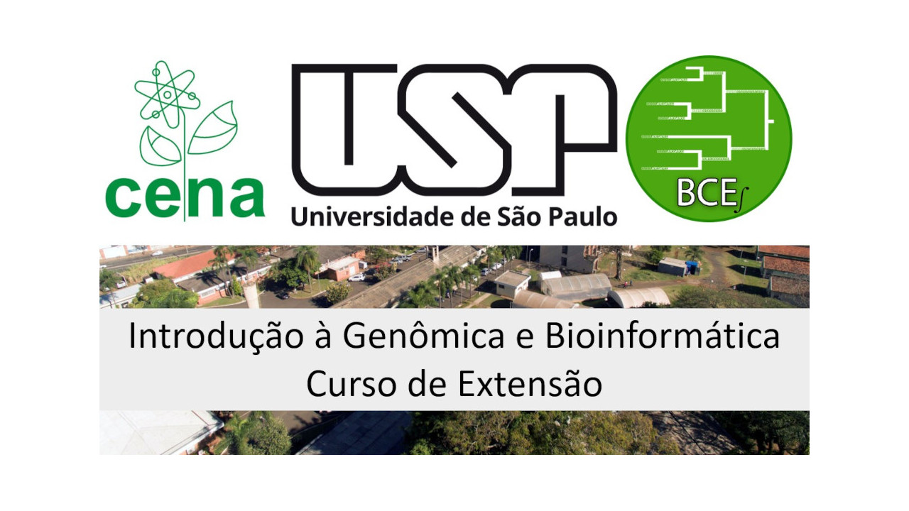

# Curso de Extensão: Introdução à Genômica e Bioinformática

## Introdução

### Objetivo 

O curso busca capacitar os alunos com conhecimentos sobre bancos de dados biológicos, métodos de sequenciamento de ácidos nucléicos, alinhamento de sequências, análise de dados de sequenciamento em larga escala, montagem e anotação de genomas, pangenômica, genômica comparativa, e análise de expressão diferencial de genes. Através de uma combinação de aulas teóricas baseadas em leituras de artigos científicos e componentes práticos usando dados reais e ferramentas bioinformáticas, os alunos desenvolverão habilidades essenciais para realizar pesquisas e análises bioinformáticas utilizando seus próprios dispositivos. O curso também enfatiza a importância do uso do sistema operacional Linux e de ferramentas de linha de comando, preparando os alunos para enfrentar os desafios práticos da área. 

### Generalidades 

O curso está dividido em módulos, cada um com um componente teórico e um componente prático. Cada módulo é realizado em dois encontros, um por semana, com duração de 3 horas cada. No primeiro encontro do módulo, abordamos o componente teórico, enquanto no segundo encontro, focamos no componente prático.

O componente teórico de cada módulo é construído a partir de leituras de livros ou artigos científicos que os alunos devem realizar previamente ao encontro com o professor. Durante o encontro, a discussão será centrada nesses artigos, guiada por uma série de perguntas que serão disponibilizadas antecipadamente.

O material para o componente prático será disponibilizado em este repositório. Os primeiros dois módulos cobrem os aspectos gerais do curso. A partir do terceiro módulo, aprofundaremos na parte metodológica da Genômica, com um enfoque computacional.

O componente prático consiste em trabalhar com dados disponíveis publicamente nos computadores. Para isso, os computadores a serem usados serão os dos mesmos alunos, seguindo o conceito de “[Bring Your Own Device](https://en.wikipedia.org/wiki/Bring_your_own_device)”, que permitirá que os alunos ainda fiquem familiarizados com os processos de instalação de software de bioinformática, além de ficar com o software nas suas máquinas e revisitar em qualquer momento os componentes práticos do curso. O único requerimento é que esteja instalado o sistema operacional Linux Ubuntu 22.04 (ou superior) com ambiente gráfico. Para conseguir desenvolver todas as aulas práticas com facilidade será necessário que o computador tenha pelo menos 16GB de RAM, 8 cores de processamento e 200GB de espaço em disco. Se os computadores não tiverem essa configuração mínima não é garantido que as sessões práticas serão executas com sucesso. 

Antes do início do curso, é imperativo que os alunos treinem por conta própria e se familiarizem com o uso do sistema operacional Linux, especialmente com a linha de comandos usando a shell Bash. Para isso, será disponibilizado material de apoio que os alunos deverão estudar de forma completamente autônoma. Esse é um pré-requisito essencial para o desenvolvimento dos temas do curso. Um segundo pré-requisito é que os alunos cheguem para o primeiro encontro com todo o software instalado, para isso será disponibilizado um [script em linguagem bash](setting_env.sh) que realizará o processo de instalação de todo o software de forma semi-automática, caso tiver problemas os alunos terão um canal de acesso a discussão pelo Discord, que será mantido durante a duração do curso para resolver dúvidas pontoais de forma assíncrona. 

### Instructor

Prof. Dr. Diego Mauricio Riaño-Pachón é o líder do [Laboratório de Biologia Computacional, Evolutiva e de Sistemas](http://labbces.cena.usp.br/) do [Centro de Energia Nuclear na Agricultura](https://www.cena.usp.br/) da [Universidade de São Paulo](https://www5.usp.br/), em Piracicaba/SP. O Prof. Riaño-Pachón trabalha na área desde o final do século XX e possui [numerosas publicações](https://labbces.cena.usp.br/publication/) nas áreas abordadas no curso. Além disso, o professor também leciona sobre esses temas em [disciplinas](https://labbces.cena.usp.br/teaching/) de graduação e pós-graduação desde 2010.

## Módulos

### Módulo 0 - Linux

Este módulo é auto-instrucional e deve ser concluído de forma independente antes do início do Módulo 1. Os alunos precisam ter um laptop com Linux Ubuntu 22.04 ou superior, 16GB de RAM, 8 núcleos de processamento e 200GB de espaço de armazenamento. Além disso, é necessário executar o [script de instalação de software de bioinformática](setting_env.sh). 

Os alunos também devem estudar com afinco o seguinte material, com o intuito de ficarem familiarizados e confortáveis no uso do sistema operacional Linux:

- [The Unix Shell](https://swcarpentry.github.io/shell-novice/)
- [Partes 1 e 2 do Unix and Shell Primer for Biologists](http://korflab.ucdavis.edu/Unix_and_Perl/current.html)
- [Command-line Bootcamp](http://korflab.ucdavis.edu/bootcamp.html)

### Módulo 1 - Bancos de dados biológicos 

[Neste módulo](modulos/modulo1.md), os alunos explorarão a evolução e a definição da bioinformática, examinando artigos que traçam a história da área e discutem seu impacto tanto globalmente quanto no Brasil. Serão apresentados aos conceitos de bancos de dados primários e secundários, com um foco especial nos recursos do National Center for Biotechnology Information, também serão vistados outras plataformas de dados como o AlphaFold Protein Structure Database por exemplo. O componente prático incluirá o uso de ferramentas básicas de Linux para operações com arquivos de texto, busca de dados em bancos de dados do NCBI, trabalho com sequências nos formatos Fasta e GenBank, e utilização do EMBOSS para recuperar sequências de grandes bancos de dados e extrair regiões específicas de um genoma. As discussões em classe serão guiadas por perguntas sobre a definição, origem, e principais avanços da bioinformática, assim como a identificação dos principais bancos de dados na área.

### Módulo 2 - Métodos de Sequenciamento de Ácidos Nucléicos

[Neste módulo](modulos/modulo2.md), os alunos explorarão os métodos de sequenciamento de ácidos nucléicos, abordando desde a complexidade dos genomas eucarióticos até a coevolução e estrutura dos genomas procarióticos. Discutiremos a importância da metagenômica e da genômica de célula única na reconstrução de genomas de procariontes não cultivados e as limitações desses métodos. Os alunos aprenderão sobre o Projeto Earth BioGenome (EBP), seus objetivos e sua contribuição para a conservação da biodiversidade global e a compreensão da evolução biológica. Também será abordado o uso das sequências genômicas como material de tipo para descrições taxonômicas de procariontes, bem como os desafios e benefícios dessa abordagem. O módulo incluirá discussões sobre como o sequenciamento genômico pode unificar diferentes áreas da pesquisa biológica, integrando dados com outras abordagens biológicas. Analisaremos o "Nanopore Adaptive Sampling" e suas vantagens para a detecção de espécies de baixa abundância em amostras metagenômicas, comparando tecnologias de sequenciamento de terceira geração. Por fim, exploraremos as inovações químicas que permitiram o desenvolvimento do sequenciamento de próxima geração (NGS) e como essas inovações impactaram a precisão e a eficiência do NGS. No componente prático, os alunos calcularão a quantidade de dados necessária para sequenciar genomas de diferentes tamanhos e tecnologias, analisarão dados de sequenciamento e trabalharão com genomas completos, anotações e arquivos de mapeamento de leituras.

### Módulo 3 - Alinhamento de Sequências: Métodos Exatos Pareados e Métodos Heurísticos BLAST

[Neste módulo](modulos/modulo3.md), os alunos aprenderão sobre os métodos de alinhamento de sequências, incluindo métodos exatos pareados e métodos heurísticos como BLAST. O componente teórico abordará algoritmos essenciais como o algoritmo de Needleman-Wunsch, a importância dos modelos de Markov ocultos (HMM), a matriz de pontuação BLOSUM62 e a técnica de programação dinâmica aplicada ao alinhamento de sequências. Além disso, discutiremos a identificação de subsequências moleculares comuns, alinhamentos de pares de sequências globais e locais, e a técnica de alinhamento múltiplo de sequências e suas variações. Também exploraremos programas de busca de sequências, suas metodologias, aplicações, benefícios e limitações. No componente prático, os alunos realizarão matrizes de pontos (dotplots), alinhamentos exatos de pares de sequências e utilizarão alinhamentos heurísticos para buscas em bancos de dados, aplicando ferramentas como BLAST para encontrar similaridades entre sequências.

### Módulo 4 - Análise de Dados de Sequenciamento em Larga Escala

[Neste módulo](modulos/modulo4.md), os alunos serão introduzidos aos conceitos e métodos fundamentais para a análise de dados de sequenciamento em larga escala. O componente teórico abordará tópicos essenciais como a profundidade e cobertura de sequenciamento, estimativas de tamanho de genoma, e a avaliação de características genômicas e qualidade de sequenciamento sem a necessidade de uma referência. Serão discutidos artigos que explicam a utilização da equação de Lander/Waterman para calcular a cobertura de sequenciamento e os desafios práticos dessa aplicação. Além disso, os alunos aprenderão sobre as implicações da distribuição não uniforme das leituras e as dificuldades na montagem de genomas de novo devido a sequências repetitivas. No componente prático, os alunos realizarão atividades como basecalling, avaliação da cobertura e profundidade de sequenciamento, formatação e avaliação da qualidade de sequências em formato FastQ, e análise de espectro de k-mers. Essas práticas fornecerão uma base sólida para a análise de dados de sequenciamento, preparando os alunos para enfrentar desafios reais na pesquisa genômica.

### Módulo 5 - Montagem de Genoma e Avaliação das Montagens

[Neste módulo](modulos/modulo5.md), os alunos se concentrarão nos métodos e desafios associados à montagem de genomas, bem como na avaliação da qualidade e completude dessas montagens. A parte teórica abordará a história e as abordagens atuais para sequenciamento e montagem de genomas, comparando as estratégias de diferentes tecnologias de terceira geração, como PacBio e Oxford Nanopore. Os alunos estudarão ferramentas como Merqury para avaliação de qualidade sem referência e BUSCO para estimar a completude e redundância das montagens. Discutiremos também a montagem de genomas de novo, com ênfase em genomas diplóides resolvidos por haplótipos e as metodologias para alcançar essa resolução sem dados parentais. No componente prático, os alunos trabalharão com dados reais para calcular métricas do genoma, realizarão montagens utilizando ferramentas como HiFiasm e Flye, e avaliarão as montagens geradas através de métricas de contiguidade e completude, bem como a identificação de telômeros. Comparações entre diferentes montagens também serão realizadas para entender melhor as vantagens e limitações de cada abordagem.

### Módulo 6 - Anotação de Genomas: Predição de Genes

[Neste módulo](modulos/modulo6.md), os alunos aprenderão sobre as técnicas e desafios da anotação de genomas, focando na predição de genes em genomas eucarióticos e procarióticos. A parte teórica incluirá uma introdução às ferramentas e métodos usados para anotação de genomas. Os alunos aprenderão sobre os benefícios e limitações do uso de dados de RNA-seq na anotação genômica e como esses dados podem melhorar a precisão das anotações. No componente prático, os alunos avaliarão a contaminação em dados genômicos, mascararão sequências repetitivas, obterão evidências extrínsecas e realizarão a anotação de um genoma.

### Módulo 7 - Pangenômica e Genômica Comparativa

[Neste módulo](modulos/modulo7.md), os alunos explorarão a análise de pangenomas e genômica comparativa, entendendo os benefícios das análises de sequência sem alinhamento e as aplicações práticas dessas técnicas. Serão discutidos artigos que tratam de análises pangenômicas em plantas e humanos, montagem de pan-genomas, e a avaliação de sintenia entre montagens genômicas. O conceito de pan-genoma será examinado, destacando sua importância e os achados em termos de diversidade genética, especialmente em populações específicas. O módulo também abordará a construção de pan-genomas baseados em gráficos e suas vantagens para a análise genômica em plantas. No componente prático, os alunos identificarão genes ortólogos e reconstruirão gráficos de pangenomas para estudos comparativos.

### Módulo 8 - Transcriptômica: Análise de Expressão Diferencial de Genes, Perfis de Genes

[Neste módulo](modulos/modulo8.md), os alunos estudarão abordagens modernas para análises transcriptômicas em plantas e outros organismos. A parte teórica incluirá uma comparação entre protocolos de RNA-seq com e sem retenção de especificidade de fita, a combinação de dados de RNA-seq com predições de genes baseadas em homologia, e a avaliação de ferramentas computacionais para quantificação de isoformas de RNA-seq. Serão discutidas as redes de co-expressão e as práticas recomendadas para análise de expressão diferencial em dados de RNA-seq de múltiplas espécies. No componente prático, os alunos aprenderão a baixar dados de RNA-Seq de repositórios públicos, realizar o pré-processamento dos dados, estimar níveis de expressão, detectar genes diferencialmente expressos e visualizar perfis de expressão, aplicando ferramentas e metodologias discutidas na parte teórica.
