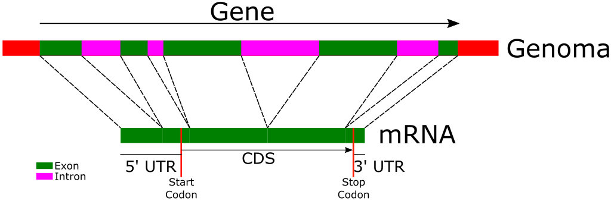

# Módulo 2 - Trabalho com dados genômicos

## Exercicios de cobertura de sequenciamento

### Cobertura de Sequenciamento (Profundidade):

- **Definição:** Número médio de vezes que cada base no genoma é lida durante o sequenciamento.
- **Importância:** Coberturas mais altas aumentam a confiança na precisão da montagem do genoma e na detecção de variantes.

Fórmula da Cobertura

$$
\text{Cobertura} = \frac{\text{Total de Bases Sequenciadas}}{\text{Tamanho do Genoma}}
$$

Rearranjando para encontrar o Total de Bases Sequenciadas:

$$
\text{Total de Bases Sequenciadas} = \text{Cobertura (C)} \times \text{Tamanho do Genoma}
$$

### Visão Geral das Plataformas de Sequenciamento

#### Sequenciamento Illumina
- **Comprimento de Leitura:** Tipicamente leituras pareadas de 150 bp (2 × 150 bp).
- **Vantagens:** Alto rendimento, baixa taxa de erro (~0,1%), custo efetivo para projetos em larga escala.
- **Considerações:** Leituras curtas podem complicar a montagem em regiões repetitivas.

#### Sequenciamento PacBio HiFi
- **Comprimento de Leitura:** Leituras de alta fidelidade com média de ~15–25 kb.
- **Vantagens:** Leituras longas com alta precisão (~99,9%), excelente para resolver regiões complexas.
- **Considerações:** Custo por base mais alto, menor rendimento comparado ao Illumina.

### Exercício 1: Cálculo da quantidade de dados para projetos de sequenciamento

Calcule a quantidade de dados necessários para realizar o sequenciamento dos seguintes organismos com os níveis de cobertura desejados. No caso de sequenciamento Illumina, considere um tamanho de leitura de 150 bp e sequenciamento pareado, para o sequenciamento PacBio HiFi, considere um tamanho de leitura de 20 kb. Calcule também o número de fragmentos que precisam ser lidos/gerados para atingir a cobertura desejada.

| Genoma               | Tamanho (Mb) | Cobertura Illumina | Cobertura PacBio HiFi |
|:---------------------|-------------:|-------------------------------:|-------------------------------:|
| Bactéria             |            5 |               100x |                            30x |
| Levedura             |           12 |                80x |                            25x |
| Planta (Arabidopsis) |          125 |                60x |                            20x |
| Humano               |        3.200 |                30x |                            30x |

Como teria que mudar a quantidade de dados gerados para o genoma humano se o interesse fosse resolver os dois haplótipos do genoma? E na planta?

- Como o tamanho do genoma afeta a quantidade total de dados de sequenciamento necessários?

- Por que diferentes níveis de cobertura são escolhidos para o sequenciamento Illumina e PacBio HiFi?

- Quais são as compensações entre usar Illumina e PacBio HiFi para o sequenciamento de genomas?

### Considerações Adicionais

- Taxas de Erro: Embora ambas as plataformas tenham baixas taxas de erro, os tipos de erros diferem.
- Complexidade de Montagem: Leituras longas do PacBio HiFi podem simplificar a montagem do genoma, especialmente para regiões repetitivas.
- Fatores de Custo: Restrições orçamentárias podem influenciar a escolha da plataforma e a cobertura alcançável.

### Capacidade de Sequenciamento dos Sistemas PacBio Revio e Illumina NovaSeq 4000

Nesta sessão, vamos calcular quantos genomas de diferentes tamanhos podem ser sequenciados simultaneamente nos sistemas PacBio Revio e Illumina NovaSeq 4000, com base nas capacidades máximas de produção de dados e coberturas mínimas desejadas.

### PacBio Revio
- Capacidade de Dados: Até 90 Gb de leituras de 20–25 kb em uma única corrida de sequenciamento.
- Cobertura Mínima Almejada: 25×

### Illumina NovaSeq 4000 com Química S4
- Capacidade de Dados: Até 3.000 Gb (3 Tb) de dados em uma única corrida de sequenciamento.
- Cobertura Mínima Almejada: 50×

Determinar quantos genomas de bactéria, levedura, planta e humano podem ser sequenciados simultaneamente com a cobertura mínima especificada.

## Visualização de dados genômicos

### Arquivos de anotação

Os formatos [GFF (General Feature Format) e GTF (Gene Transfer Format)](https://www.ensembl.org/info/website/upload/gff.html) são amplamente utilizados para anotar genomas. Estes arquivos descrevem as localizações de diferentes elementos genômicos, como genes, exons, introns e outras características, usando uma estrutura tabular que pode ser visualizada no terminal Linux.

#### Estrutura Básica dos Arquivos GFF e GTF

Ambos os formatos compartilham a ideia de dividir a anotação em colunas. As colunas comuns em ambos são:

- **Seqname:** Nome da sequência (cromossomo ou scaffolds) onde a característica foi encontrada.
- **Fonte (Source):** Ferramenta ou banco de dados que produziu a anotação.
- **Tipo (Feature):** Tipo da característica anotada, como "gene", "mRNA", "exon", etc.
- **Início (Start):** Primeira posição do genoma onde a característica está localizada.
- **Fim (End):** Última posição da característica.
- **Score:** Valor de confiança (ou . se não for aplicável).
- **Strand:** Cadeia de DNA (+ para sentido direto, - para sentido reverso).
- **Frame:** Informações de fase de leitura do codon (usado em CDSs).
- **Atributos (Attributes):** Informações adicionais no formato chave-valor.

Diferenças:
- O GFF (versão mais comum é GFF3) é mais simples e genérico. O campo de atributos usa formato separado por ponto-e-vírgula (;) com valores nomeados.
- O GTF, mais específico para genes, contém atributos mais detalhados e foi projetado para ser usado pelo Ensembl. Os atributos são pares chave-valor separados por espaços e terminados por ponto-e-vírgula.

Exemplo GFF:

```
scaffold_1  maker gene  1000  2000  .  +  .  ID=gene0001;Name=my_gene
scaffold_1  maker mRNA  1000  2000  .  +  .  ID=mRNA0001;Parent=gene0001;Name=my_mRNA
scaffold_1  maker exon  1000  1500  .  +  .  ID=exon0001;Parent=mRNA0001

```

Exemplo GTF:

```
scaffold_1  maker gene  1000  2000  .  +  .  gene_id "gene0001"; gene_name "my_gene";
scaffold_1  maker transcript 1000  2000  .  +  .  gene_id "gene0001"; transcript_id "mRNA0001";
scaffold_1  maker exon  1000  1500  .  +  .  gene_id "gene0001"; transcript_id "mRNA0001";

```

#### Anotação do genoma de _Spodoptera frugiperda_

No módulo anterior, você descarregou o genoma de Spodoptera frugiperda, que ficou armazenado na pasta `~/dia1`. Por favor, mova esse arquivo para a pasta `~/dia2`, entre nessa pasta e descarregue a anotação do mesmo genoma em formato GFF usando o seguinte comando:

```bash
cd ~/dia2/
wget https://ftp.ncbi.nlm.nih.gov/genomes/all/GCF/023/101/765/GCF_023101765.2_AGI-APGP_CSIRO_Sfru_2.0/GCF_023101765.2_AGI-APGP_CSIRO_Sfru_2.0_genomic.gff.gz
gunzip GCF_023101765.2_AGI-APGP_CSIRO_Sfru_2.0_genomic.gff.gz
```

Visualize o conteúdo do arquivo descarregado usando o comando `less` e identifique cada uma das colunas mencionadas acima.

Quais valores podem aparecer na coluna de **Features**? Podemos usar o Linux para obter uma lista dos valores únicos que aparecem na coluna Feature do arquivo. Note que essa é a terceira coluna no arquivo:

```bash
cat GCF_023101765.2_AGI-APGP_CSIRO_Sfru_2.0_genomic.gff|grep -v "#"| cut -f 3|sort -u
```

Você também pode contar quantas vezes cada um desses valores aparece no arquivo de anotação:

```bash
cat GCF_023101765.2_AGI-APGP_CSIRO_Sfru_2.0_genomic.gff|grep -v "#"| cut -f 3|sort | uniq -c
```

Repare no número de features do tipo exon e CDS que aparecem no arquivo. Por que esses números são diferentes?

A seguinte figura pode auxiliar nessa interpretação:



Vamos extrair uma região de interesse do arquivo GFF. Confira o arquivo [test.bed](files/test.bed), faça o download e coloque-o na pasta `~/dia2`. Esse é um tipo de arquivo amplamente utilizado para representar regiões do genoma. Especificamente, agora temos a posição do gene **cytochrome P450 9e2**, sobre o qual discutimos no módulo passado. Vamos extrair todas as features que estão dentro desse intervalo. Para isso, utilizaremos o comando `bedtools intersect`:


```bash
conda activate bedtools
cd ~/dia2/
bedtools intersect -a GCF_023101765.2_AGI-APGP_CSIRO_Sfru_2.0_genomic.gff -b extGenoBioinfo/modulos/files/test.bed > cytochromeP4509e2.gff
echo '##gff-version 3' | cat - cytochromeP4509e2.gff > cytochromeP4509e2b.gff
mv cytochromeP4509e2b.gff cytochromeP4509e2.gff
conda deactivate
```

Inspecione o arquivo resultante cytochromeP4509e2.gff. Agora, vamos gerar um gráfico dessa região usando a ferramenta genometools, especificamente a função [annotation sketch](https://genometools.org/annotationsketch.html):
    
```bash
gt sketch cytochromeP4509e2.png cytochromeP4509e2.gff
```

Identifique na figura as UTRs (regiões não traduzidas), a região codificadora (CDS) e os éxons do gene.

### Arquivos de mapeamento de leituras

Na sua pasta `~/dia2`, descarregue a pasta inteira: https://labbces.cena.usp.br/shared/extGenoBioinfo/BAM/

```bash
cd ~/dia2/
wget -r -np -nH --cut-dirs=4 -R "index.html*" https://labbces.cena.usp.br/shared/extGenoBioinfo/BAM/ -P ~/dia2/BAM
```

Deveria ter os seguintes arquivos na pasta `~/dia2/BAM/`:

```bash
$ ls -1 ~/dia2/BAM/
GCF_023101765.2_AGI-APGP_CSIRO_Sfru_2.0_genomic.gff.gz
GCF_023101765.2_AGI-APGP_CSIRO_Sfru_2.0_genomic.sorted.gff.gz
GCF_023101765.2_AGI-APGP_CSIRO_Sfru_2.0_genomic.sorted.gff.gz.tbi
NC_064213.1.fasta
NC_064213.1.fasta.fai
robots.txt
SRR12072097_PacBio_NC_064213.1_sorted.bam
SRR12072097_PacBio_NC_064213.1_sorted.bam.bai
SRR29141966_Illumina_NC_064213.1_sorted.bam
SRR29141966_Illumina_NC_064213.1_sorted.bam.bai
SRR29288667_RNASeq_NC_064213.1_sorted.bam
SRR29288667_RNASeq_NC_064213.1_sorted.bam.bai
```

Nessa pasta, você encontrará arquivos FASTA e GFF que já conhece, mas também arquivos BAM. O formato BAM é um formato binário que armazena alinhamentos de sequências de leituras de sequenciamento de DNA. O arquivo BAM é indexado para permitir acesso rápido a regiões específicas do genoma, e o arquivo BAI é o índice correspondente do arquivo BAM.

Existem três arquivos BAM diferentes, um para cada tipo de sequenciamento: PacBio, Illumina e RNA-Seq. As leituras correspondentes foram alinhadas ao genoma da Spodoptera frugiperda (GCF_023101765.2_AGI-APGP_CSIRO_Sfru_2.0_genomic.fna).

Hoje não veremos como gerar esses arquivos, mas, se tiver curiosidade, pode consultar o script que foi [usado](files/generateBAM.sh). Por enquanto, vamos visualizar esses arquivos na linha de comandos e usando o software [Integrative Genomics Viever (IGV)](https://igv.org/).

O arquivo BAM não pode ser inspecionado diretamente com os visualizadores de texto que usamos até o momento, pois está em formato binário. Para visualizar o conteúdo do arquivo BAM, podemos usar o comando `samtools view`, que converte o arquivo BAM em um formato legível (SAM):

```bash
conda activate igv
samtools view ~/dia2/BAM/SRR29288667_RNASeq_NC_064213.1_sorted.bam|less
```

O comando acima exibirá as leituras alinhadas no arquivo BAM. O formato SAM (Sequence Alignment/Map) possui uma estrutura tabular e contém informações detalhadas sobre a qualidade das leituras e o alinhamento. Cada linha no arquivo SAM representa uma leitura alinhada e é composta por diversos campos separados por tabulações, incluindo:

- QNAME: Identificador da leitura.
- FLAG: Informações sobre o alinhamento, como se a leitura está mapeada, se é parte de um par, entre outros.
- RNAME: Nome da referência genômica onde a leitura está alinhada.
- POS: Posição inicial do alinhamento na referência.
- MAPQ: Qualidade do mapeamento.
- CIGAR: Descrição do alinhamento da leitura em relação à referência (matches, inserções, deleções, etc.).
- RNEXT: Nome da referência da próxima leitura (se aplicável).
- PNEXT: Posição da próxima leitura.
- TLEN: Comprimento do fragmento inserido.
- SEQ: Sequência da leitura.
- QUAL: Pontuação de qualidade da sequência.

Além desses campos obrigatórios, o formato SAM pode incluir campos opcionais que fornecem informações adicionais, como marcações de variantes, detalhes de modificações químicas ou anotações específicas do experimento.

Vamos olhar uma das linhas do nosso arquivo BAM:

```
SRR29288667.583533      409     NC_064213.1     9949    1       120M    =       9949    0       ACCGTGCAGCACCGGTTGCGCGCTCCTTGGCGGCGACCTTTTCTTCTAGGTCCTTTTGAACCTCCACCCGCTTTGCTTGCGCCAGAGACGCCCTCAATTGGCGTTGAGCCTCATCAAGTC        FFFFFFFFFFFFFFFFFFFFFFFFFFFFFFFFF:F:FFFFFFFFF:FF:FFF:FFFFFFFFFFFFFFFFFFFF,FFFFFF,FFF:FFF:F:FFFFFFF,FF,FFFFFFF::FFFFFFFFF     AS:i:0  ZS:i:0  XN:i:0  XM:i:0  XO:i:0  XG:i:0  NM:i:0  MD:Z:120        YT:Z:UP NH:i:5
```

| **Campo** | **Valor** | **Descrição** |
|---|---|---|
| **QNAME**  | SRR29288667.583533  | **Identificador da Leitura:** Nome único que identifica a leitura sequenciada. |
| **FLAG**   | 409 | **Flags:** Valores numéricos que fornecem informações sobre o alinhamento, como orientação, se está emparelhada, se está mapeada, etc.  |
| **RNAME** | NC_064213.1 | **Nome da Referência:** Identificador do cromossomo ou sequência de referência onde a leitura está alinhada. |
| **POS**  | 9949 | **Posição:** Posição 1-based na referência onde o alinhamento da leitura começa. |
| **MAPQ** | 1 | **Qualidade do Mapeamento:** Pontuação que indica a confiança do alinhamento (0 a 60, onde valores mais altos indicam maior confiança). |
| **CIGAR** | 120M  | **CIGAR String:** Representa o alinhamento da leitura com a referência. "120M" indica que as 120 bases da leitura estão alinhadas (matches). |
| **RNEXT** | = | **Nome da Referência da Próxima Leitura:** Indica a referência onde a próxima leitura do par está alinhada. "=" significa que está na mesma referência que `RNAME`. |
| **PNEXT** | 9949 | **Posição da Próxima Leitura:** Posição 1-based na referência onde a próxima leitura do par começa. |
| **TLEN** | 0 | **Comprimento do Fragmento Inserido:** Diferença entre as posições das leituras emparelhadas. "0" indica que não há inserção ou a posição é igual. |
| **SEQ** | ACCGTGCAGCACCGGTTGCGCGCTCCTTGGCGG... | **Sequência da Leitura:** Sequência de nucleotídeos da leitura alinhada. |
| **QUAL** | FFFFFFFFFFFFFFFFFFFFFFFFFFFFFFFFF... | **Qualidade da Sequência:** Pontuações de qualidade para cada base na sequência (`F` geralmente indica alta qualidade). |
| **AS:i:0** | AS:i:0 | **Score de Alinhamento (AS):** Indica a pontuação do alinhamento, onde valores mais altos representam melhores alinhamentos. Neste caso, 0 pode indicar um alinhamento padrão ou sem pontuação adicional. |
| **ZS:i:0** | ZS:i:0 | **Campo Personalizado (ZS):** Utilizado para informações específicas do pipeline de sequenciamento. Aqui, `0` pode indicar ausência de uma característica específica.  |
| **XN:i:0** | XN:i:0 | **Campo Personalizado (XN):** Usado para armazenar informações adicionais como número de mismatches extras. `0` indica ausência dessas características. |
| **XM:i:0** | XM:i:0 | **Campo Personalizado (XM):** Usado para armazenar informações adicionais como inserções extras. `0` indica ausência dessas características. |
| **XO:i:0** | XO:i:0 | **Campo Personalizado (XO):** Usado para armazenar informações adicionais como deleções extras. `0` indica ausência dessas características. |
| **XG:i:0** | XG:i:0 | **Campo Personalizado (XG):** Usado para armazenar informações adicionais sobre diferenças genéticas. `0` indica ausência dessas características. |
| **NM:i:0** | NM:i:0 | **Número de Mismatches (NM):** Indica o número de diferenças entre a leitura e a referência. `0` significa que a leitura está perfeitamente alinhada sem mismatches. |
| **MD:Z:120** | MD:Z:120 | **Detalhes do Mismatch (MD):** Fornece informações sobre as diferenças específicas entre a leitura e a referência. `120` indica que as 120 bases estão alinhadas sem diferenças. |
| **YT:Z:UP** | YT:Z:UP | **Tipo de Alinhamento (YT):** `UP` geralmente indica um alinhamento único (Unique alignment). |
| **NH:i:5** | NH:i:5 | **Número de Alinhamentos (NH):** Indica o número total de alinhamentos diferentes encontrados para esta leitura. `5` sugere que esta leitura se alinha em cinco locais diferentes na referência. |

Você pode usar [esta calculadora](https://broadinstitute.github.io/picard/explain-flags.html) de Flags do Picard para identificar o significado de cada flag no formato SAM/BAM. Selecione algumas entradas do seu arquivo BAM e interprete-as utilizando a ferramenta.

Se tiver interesse em aprofundar seu entendimento, você pode conhecer o significado detalhado de cada bit do campo FLAG [aqui](https://www.samformat.info/sam-format-flag).
