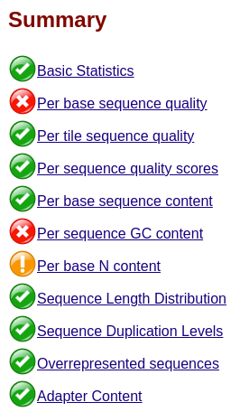
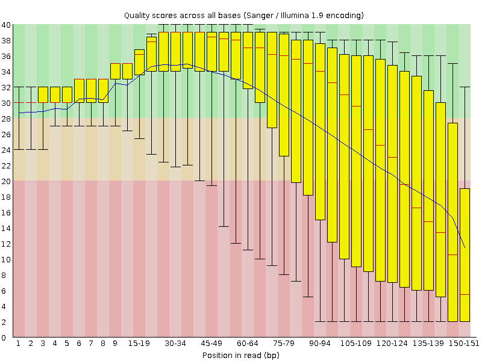
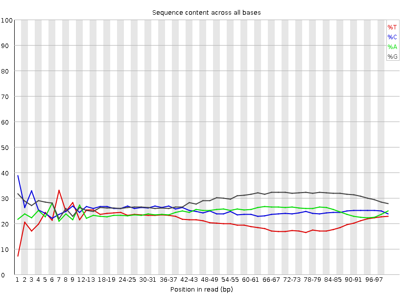
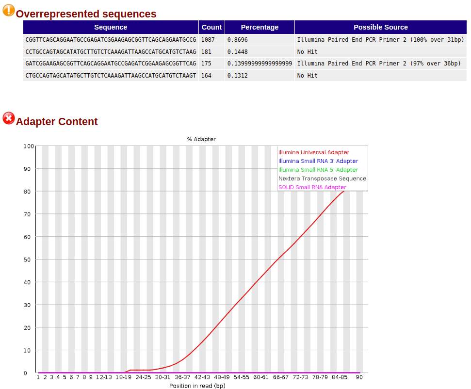
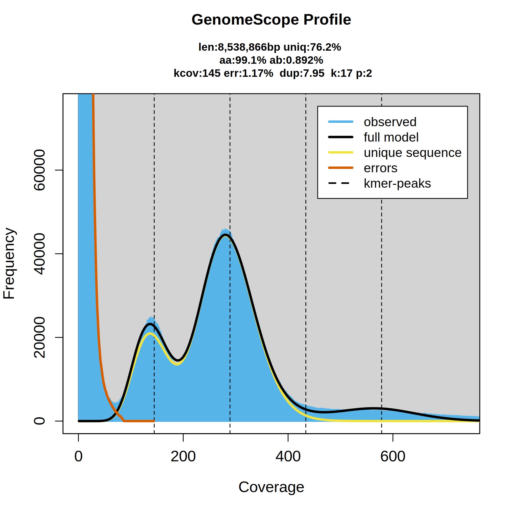
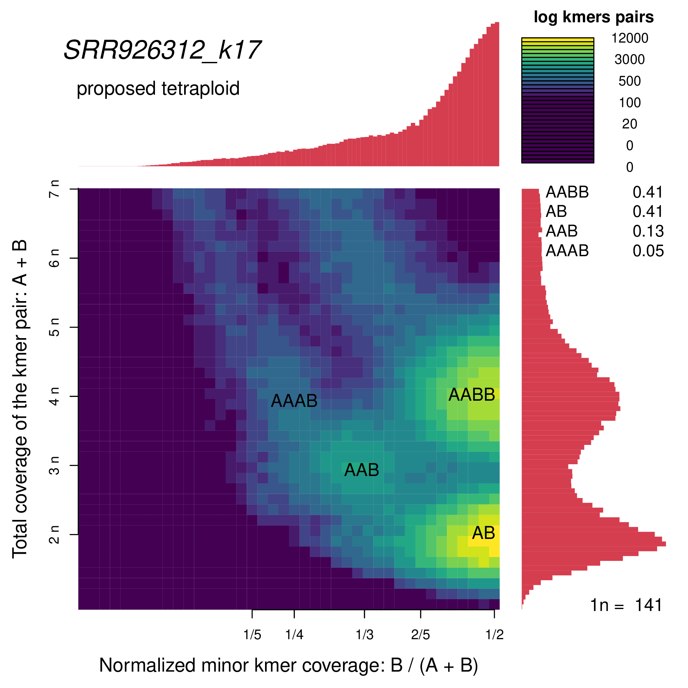

# Módulo 4 - Análise de Dados de Sequenciamento em Larga Escala
Crie uma nova pasta no seu HOME chamda `dia4`:

```bash
mkdir ~/dia4
cd ~/dia4
```

## Avaliando a qualidade de sequencias Illumina

Sempre que receber suas sequências da Illumina, é muito importante conferir a qualidade. Deve-se prestar atenção à presença de adaptadores (sequências adicionadas aos alvos de sequenciamento que precisam ser removidas antes de continuar com as análises), regiões de baixa qualidade (que geralmente também precisam ser removidas) e qualquer viés que possa levantar suspeitas sobre o sequenciamento. Os resultados da análise de qualidade sempre devem ser interpretados à luz do seu conhecimento sobre o tipo de amostra que foi sequenciada, incluindo os kits que foram usados para a criação das bibliotecas.

Vamos verificar diferentes métricas da qualidade de 4 corridas de sequenciamento nos arquivos:

- [qc1.fq.gz](files/qc1.fq.gz)
- [qc2.fq.gz](files/qc2.fq.gz)
- [qc3.fq.gz](files/qc3.fq.gz)
- [qc4.fq.gz](files/qc4.fq.gz)

Observe que os arquivos estão compactados, isso é sempre feito para economizar espaço de armazenamento. A maioria dos programas que iremos usar pode trabalhar com os dados nesse formato.

Baixe os arquivos e certifique-se de movê-los para a pasta `~/dia4`.

O comando `less` é capaz de visualizar até mesmo arquivos compactados. Vamos inspecionar o arquivo qc1.fq.gz, que deve estar na sua pasta `~/dia4`.

```
cd ~/dia4
less qc1.fq.gz
```

Este arquivo está no formato [FastQ](https://en.wikipedia.org/wiki/FASTQ_format), uma extensão do formato fasta, no qual cada sequência ocupa 4 linhas. A primeira linha contém o identificador da sequência, a segunda linha contém a sequência de nucleotídeos, a terceira linha é um espaço onde apenas o sinal `+` aparece, e a quarta linha contém caracteres que representam os valores de qualidade (Phred Score, Q) das bases correspondentes.

```
@SEQ_ID
GATTTGGGGTTCAAAGCAGTATCGATCAAATAGTAAATCCATTTGTTCAACTCACAGTTT
+
!''*((((***+))%%%++)(%%%%).1***-+*''))**55CCF>>>>>>CCCCCCC65
```

O formato FastQ pode de fato usar diferentes encodings para representar os valores de qualidade (Phred Scores). Os encodings mais comuns são o Sanger, o Illumina 1.8+ e o Solexa. Cada um deles utiliza uma escala de valores diferentes para representar a qualidade das bases nucleotídicas em uma sequência.

Para obter informações detalhadas sobre os diversos encodings do formato FastQ, recomendo que você acesse a página do [FastQ](https://en.wikipedia.org/wiki/FASTQ_format) na Wikipedia ou em outras fontes confiáveis de informações científicas ou bioinformáticas. Lá você encontrará uma descrição dos encodings e como eles são utilizados. É importante indicar o encoding correto para realizar operações nos arquivos de sequenciamento.

Agora, utilizaremos o comando `fastqc` para avaliar a qualidade dos arquivos de sequenciamento. Este software pode ser executado com ou sem uma interface gráfica. Primeiro, devemos ativar o ambiente Conda onde o `fastqc` está instalado e, em seguida, executar o programa no modo de linha de comando. Isso resultará na geração de dois arquivos: um em formato _.zip_ e outro em formato _.html_. O arquivo _.html_ pode ser visualizado em nosso navegador.

```
conda activate fastqc
fastqc qc1.fq.gz
```
você vai ter que executar o programa para cada um dos arquivos de sequenciamento (qc1.fq.gz, qc2.fq.gz, qc3.fq.gz e qc4.fq.gz).

Observe que o programa `fastqc` oferece diversos módulos de análise, como ilustrado na figura a seguir:



À esquerda de cada módulo, é exibido um símbolo que pode ser um _check_ (✓), um _exclamação_ (!), ou um _X_. O símbolo _!_ indica a necessidade de prestar uma atenção especial aos resultados deste módulo, pois ele parece apresentar aspectos que diferem do esperado. O símbolo _X_ indica que a análise identificou problemas nos dados.

### qc1.fq.gz

Durante a análise dos dados no arquivo qc1.fq.gz, é evidente que a qualidade por posição (_Per base sequence quality_) decai significativamente em direção ao extremo 3'. Portanto, é altamente recomendado executar um processo de _qualitry trimming_ para eliminar as bases de menor qualidade, começando no extremo 3' e seguindo em direção ao 5'. Esse procedimento pode ser realizado eficazmente utilizando o programa `bbduk`.



### qc2.fq.gz

A análise deste conjunto de dados revela que a qualidade dos dados é excelente e não é necessária nenhuma modificação nos dados brutos. Portanto, é seguro prosseguir com os próximos passos da análise sem problemas.

### qc3.fq.gz

Da mesma forma que no arquivo qc1.fq.gz, o módulo "Per base sequence quality" detectou questões neste conjunto de dados, levando o pesquisador a considerar imediatamente a necessidade de executar o processo de "qualitry trimming".

O módulo "Per base sequence content" também foi identificado como relevante, e a análise deve ser interpretada à luz do tipo de dados e da química de sequenciamento para determinar se existem quaisquer problemas significativos. Este conjunto de dados foi gerado utilizando a tecnologia Nextera da Illumina, que, no processo de criação das bibliotecas, fragmenta o material de sequenciamento e adiciona os adaptadores em um único passo, conhecido como _tagmentation_. Saiba mais sobre essa tecnologia [aqui]((https://www.illumina.com/techniques/sequencing/ngs-library-prep/tagmentation.html)). Observe que em uma molécula grande de DNA, é esperado que a proporção de G seja igual à de C, e a proporção de A seja igual à de T. Nesta análise, podemos notar desvios dessa expectativa tanto na extremidade 5' quanto na extremidade 3', no entanto, os motivos para esses desvios são distintos. Qual é a sua opinião sobre a causa dessas discrepâncias? 



Para obter uma compreensão mais detalhada da discrepância observada na extremidade 3', recomendamos examinar os resultados dos módulos _Overrepresented sequences_ e _Adapter Content_. Você notará a presença de adaptadores nesses resultados, o que indica a necessidade de removê-los. Agora, por que você acredita que adaptadores estão surgindo nessa extremidade?



Nesse contexto, no processo de limpeza, é igualmente crucial eliminar as sequências de adaptadores.

Para realizar a limpeza, podemos utilizar o programa `bbduk.sh` da suíte `bbmap`. Para utilizá-lo, é necessário desativar qualquer ambiente Conda previamente ativado e ativar o ambiente `bbmap` da seguinte maneira:

```
conda deactivate
conda activate bbmap
bbduk.sh in=qc3.fq.gz ref=adapters out=qc3.clean.fq.gz ktrim=r qtrim=w trimq=20 minlength=70 k=15
conda deactivate
```

Em seguida, verifique a qualidade das sequências limpas usando o `fastqc`. Execute este procedimento para todos os arquivos neste exercício.

### Análise de espectros de k-mers

Os [k-mer](https://en.wikipedia.org/wiki/K-mer) são sequências de DNA de tamanho _k_ encontradas em uma sequência maior. É importante observar que para obter todos os k-mer de uma sequência, você começa no primeiro nucleotídeo da sequência e pega os próximos k nucleotídeos. Em seguida, você desloca-se um nucleotídeo à frente e pega os k nucleotídeos, repete o processo até chegar no fim da sequência, i.e., até não conseguir pegar k nucleotídeos. Vamos a listar todos os k-mer, com k=3, isto é vamos gerar o catálogo de k-mers da sequência abaixo:

```
Sequência:   ACGTAGCGTAGGT
3-mer 1:     ACG
3-mer 2:      CGT
3-mer 3:       GTA
3-mer 4:        TAG
3-mer 5:         TGC
3-mer 6:          GCG
3-mer 7:           CGT
3-mer 8:            GTA
3-mer 9:             TAG
3-mer 10:             AGG
3-mer 11:              GGT

```

Observe que a quantidade de k-mers distintos possíveis corresponde a 4 elevado à k-ésima potência (__4^k__). Ao analisar estatísticas relacionadas aos k-mers em dados brutos de sequenciamento, é possível obter _insights_ sobre as características do genoma em estudo, mesmo antes de iniciar o processo de montagem. Além disso, muitas dessas estimativas, obtidas por meio das estatísticas dos k-mers, podem orientar e influenciar os procedimentos de montagem e anotação do genoma.

Por meio do catálogo de k-mers, é possível calcular as frequências empíricas dos k-mers em um conjunto de dados, ou até mesmo em um genoma já montado, resultando no espectro de k-mers desses dados. A frequência empírica dos k-mers na sequência acima é a seguinte:


| k-mer | Freq |
| --- | --- |
| ACG | 1 |
| AGG | 1 |
| CGT | 2 |
| GCG | 1 |
| GTA | 2 |
| GGT | 1 |
| TAG | 2 |
| TGC | 1 |
| TTG | 1 |


A partir da frequência empírica de k-mers, podemos calcular o espectro de k-mers, que nada mais é do que um histograma da coluna _Freq_ da tabela acima. Ou seja, o espectro de k-mers informa quantos k-mers distintos aparecem com uma frequência _x_ (multiplicidade ou profundidade), da seguinte maneira:

| Número kmers | Multiplicidade |
| --- | --- |
| 6 | 1 |
| 3 | 2 |


A partir das frequências empíricas dos k-mers e do espectro de k-mers, é possível estimar várias características do genoma, incluindo tamanho, heterozigosidade, fração do genoma composta por sequências repetitivas e ploidia. Para realizar essas estimativas, podemos utilizar ferramentas como o [GenomeScope2 e o SmudgePlots](https://www.nature.com/articles/s41467-020-14998-3/).

Os exercícios desta sessão estão baseados [neste](https://github.com/BGAcademy23/smudgeplot) tutorial. Nos próximos exercícios, utilizaremos os seguintes conjuntos de dados.

| Grupo | Espécie | SRR ACC | Comando para descarregar os dados | Artigo | 
| ---   | --- | --- | --- | --- | 
| 1 | _Pseudoloma neurophilia_ | SRR926312 | wget ftp://ftp.sra.ebi.ac.uk/vol1/fastq/SRR926/SRR926312/SRR926312_[12].fastq.gz | [Ndikumana et al., 2017](https://pubmed.ncbi.nlm.nih.gov/27230544/) | 
| 2 | _Tubulinosema ratisbonensis_ | ERR3154977 | wget ftp://ftp.sra.ebi.ac.uk/vol1/fastq/ERR315/007/ERR3154977/ERR3154977.fastq.gz  | [Polonais et al., 2019](https://www.ncbi.nlm.nih.gov/pmc/articles/PMC6675976/) | 
| 3 | _Nosema ceranae_ | SRR17317293 | wget ftp://ftp.sra.ebi.ac.uk/vol1/fastq/SRR173/093/SRR17317293/SRR17317293_[12].fastq.gz  |
| 4 | _Nematocida parisii_ | SRR058692 | wget ftp://ftp.sra.ebi.ac.uk/vol1/fastq/SRR058/SRR058692/SRR058692.fastq.gz  | [Cuomo et al., 2012](https://pubmed.ncbi.nlm.nih.gov/22813931/) |
| 5 | _Nematocida ausubeli_ | SRR350188 | wget ftp://ftp.sra.ebi.ac.uk/vol1/fastq/SRR350/SRR350188/SRR350188_[12].fastq.gz  | [Cuomo et al., 2012](https://pubmed.ncbi.nlm.nih.gov/22813931/) |
| 6 | _Hamiltosporidium tvaerminnensis_ | SRR16954898 | wget ftp://ftp.sra.ebi.ac.uk/vol1/fastq/SRR169/098/SRR16954898/SRR16954898_[12].fastq.gz  | [Angst et al., 2023](https://pubmed.ncbi.nlm.nih.gov/37565496/) |
| 7 | _Encephalitozoon hellem_ | SRR14017862 | wget ftp://ftp.sra.ebi.ac.uk/vol1/fastq/SRR140/062/SRR14017862/SRR14017862_[12].fastq.gz  |
| 8 | _Agmasoma penaei_ | SRR926341 | wget ftp://ftp.sra.ebi.ac.uk/vol1/fastq/SRR926/SRR926341/SRR926341_[12].fastq.gz  | [Sokolova et al., 2015](https://pubmed.ncbi.nlm.nih.gov/25449947/) |

Por favor, realize o download desses conjuntos de dados para a sua pasta `~/dia4`, criando uma subpasta chamada `espectro`.

```
cd ~/dia4
mkdir espectro
cd espectro
```

Para preparar o software que usaremos nesta sessão, precisamos garantir que o ambiente Conda do GenomeScope2 esteja ativado. Antes de fazer isso, lembre-se de desativar qualquer outro ambiente atualmente ativo.

```
conda deactivate
conda activate genomescope2
```

Vamos proceder com a instalação de uma ferramenta muito rápida para catalogar e contar k-mers, o FastK, bem como a versão de desenvolvimento do SmudgePlot:.

```
mkdir src bin && cd src # Crie diretórios para o código-fonte e os binários. 
git clone -b sploidyplot https://github.com/KamilSJaron/smudgeplot
git clone https://github.com/thegenemyers/FastK

cd smudgeplot
make -s INSTALL_PREFIX=~/miniconda3/envs/genomescope2/
R -e 'install.packages(".", repos = NULL, type="source")'
cd ..
smudgeplot.py -h # Teste se a instalação foi bem-sucedida.
cd FastK && make
install -c FastK Fastrm Fastmv Fastcp Fastmerge Histex Tabex Profex Logex Vennex Symmex Haplex Homex Fastcat /home/cen5789/miniconda3/envs/genomescope2/bin/
FastK # Teste se a instalação foi bem-sucedida.
cd ../.. 
pwd # Você tem que estar na pasta ~/dia4/espectro

```

#### Contando k-mers

Este processo opera com leituras de sequenciamento cruas ou limpas. A partir delas, geramos um banco de dados de k-mers usando o `FastK`. O FastK é um contador de k-mers muito rápido, tal vez o mais rápido hoje e é o único suportado pela versão mais recente do SmudgePlot (que instalamos acima). Este banco de dados contém um índice de todos os k-mers e suas coberturas no conjunto de leituras de sequenciamento. 

Então, por favor, construa o banco de dados utilizando o `FastK`. Este processo levará alguns minutos (15-20). Certifique-se de utilizar o arquivo de leituras correto, e eu recomendaria nomear o banco de dados com o número de acesso do SRA correspondente. Vamos realizar estas analises com varios valores de k:{17,21,31,41,51,71}, e vamos comparar os resultados. No `FastK` você pode modificar o tamanho do k-mer com o argumento `-k`.

```
FastK -v -t4 -k17 -M16 -T4 SRR926312_[12].fastq.gz -NSRR926312_k17
```

Agora, Você pode obter o espectro de k-mers a partir do banco de dados usando o Histex, uma ferramenta diferente da mesma suíte.

```
Histex -G SRR926312_k17 > SRR926312_k17.histo
```

Você pode visualizar o histograma criado com qualquer visualizador de arquivos de texto plano, e.g., `less`.

#### GenomeScope2

Agora com o arquivo `.histo`, podemos executar o GenomeScope2 para estimar algumas caracteristicas do genoma.

```
genomescope2 --input SRR926312_k17.histo --output SRR926312_k17.genomescope2 --ploidy 2 --kmer_length 17 --name_prefix SRR926312_k17
```

Visualize os arquivos de figuras. Uma delas é `SRR926312_k17.genomescope2/SRR926312_k17_linear_plot.png`:



Também é essencial prestar atenção ao arquivo "_summary.txt".

Observe que, para executar o GenomeScope2, precisamos especificar a ploidia do organismo. No entanto, nem sempre conhecemos essa característica com antecedência. Nesse caso, podemos usar o SmudgePlot para estimar o nível de ploidia e, em seguida, rodar o GenomeScope2 novamente. O resultado preliminar do GenomeScope2 pode nos auxiliar na identificação do limiar de k-mers incorretos, que é a cobertura/multiplicidade no primeiro vale do espectro de k-mers. O primeiro pico corresponde a uma grande quantidade de k-mers distintos, mas com baixa cobertura. Identifique o valor desse vale e continue com o SmudgePlot.

#### SmudgePlot

Do conjunto de k-mers e suas coberturas, o usuário deve escolher um limiar para excluir k-mers de baixa frequência que serão considerados erros. Essa escolha não é muito difícil de ser feita ao analisar o espectro de k-mers, podemos usar o espectro gerado anteriormente pelo GenomeScope2 para selecionar esse limiar. Agora, de todos os k-mers retidos, encontramos todos os het-mers. Em seguida, criamos um histograma 2D.

Neste exemplo, um limite de erro significativo seria 70x. Como regra geral, nenhum conjunto de dados deve ter esse limite inferior a 10x, e não é o fim do mundo se perdermos um pouco dos k-mers genômicos reais (desde que haja sinal suficiente). No entanto, essas são apenas algumas orientações; o que é sensato realmente depende de cada conjunto de dados individual!

O limite de erro é especificado pelo parâmetro '-L'. Temos 4 núcleos na nossa máquina, então você também pode executar a busca de pares de k-mers em paralelo (parâmetro -t). Ao executar, não se esqueça de usar os nomes de SUA amostra, e não o exemplo fornecido.

```
smudgeplot.py hetmers -L 70 -t 4 --verbose -o SRR926312_k17_pairs SRR926312_k17.ktab

```

E, por fim, uma vez que os pares de k-mers estejam prontos, um arquivo *_text.smu deve ser gerado. Trata-se de um histograma 2D, no qual para cada combinação de covA e covB, você encontrará a frequência com que essas duas coberturas ocorrem entre os het-mers (os pares de k-mers adjacentes um do outro).

```
head SRR926312_k17_pairs_text.smu
```

Se você ver três colunas, é um bom sinal. Você pode prosseguir para finalmente plotar o SmudgePlot. Eu encorajaria você a executar `smudgeplot plot -h` para ver todas as opções e entender o que elas significam, mas um comando minimalista como este deve funcionar:

```
smudgeplot.py all -o SRR926312_k17_smudgeplot SRR926312_k17_pairs_text.smu
```



Um gráfico com várias manchas (_smudges_) e anotações que se sobrepõem às manchas. No painel superior direito, você verá proporções de pares de k-meres nas manchas individuais, ordenadas por frequência. No canto inferior direito, você verá a estimativa de cobertura 1n para o conjunto de dados. Esta é a mesma cobertura 1n que foi inferida pelo GenomeScope; esses dois números precisam ser muito semelhantes para que o modelo e o SmudgePlot estejam contando a mesma história. Se eles forem substancialmente diferentes, é necessário investigar o motivo. Em genomas diferentes, o SmudgePlot ou o GenomeScope são melhores para determinar a cobertura, e geralmente as diferenças são em uma ordem de magnitude de 2. Se você acha que a estimativa de cobertura do SmudgePlot está errada, execute o SmudgePlot novamente com o parâmetro '-n' e forneça um número correspondente ao pico 1n em seu gráfico GenomeScope, como '-n 50'.

Neste exemplo, o SmudgePlot sugere um organismo tetraploide, mas observe que a proporção de hetmers diploides e tetraploides é a mesma. Tente executar o GenomeScope2 com ploidia 4 e compare os resultados de ajuste do modelo. Contraste os resultados dos outros valores de k.
