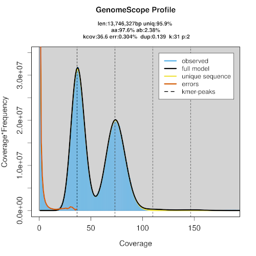
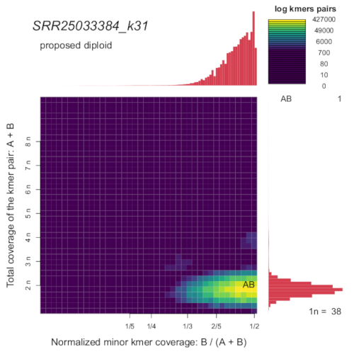
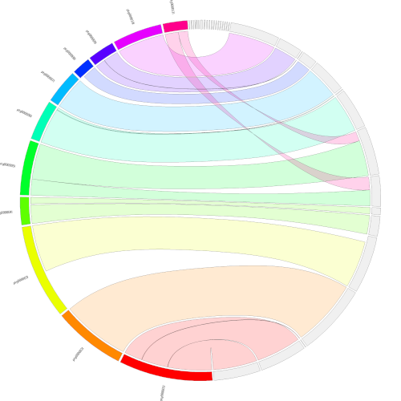

# Módulo 5 - Montagem de Genoma e Avaliação das Montagens

Vamos trabalhar na pasta ~/dia5. Caso ela não exista, por favor, crie-a em sua pasta HOME.

## Obtendo os dados e calculando métricas do genoma

Vamos montar o genoma de uma levedura, a _Kazachstania bulderi_ da cepa NRRL Y-27205 ([Balarezo-Cisneros et al., 2023])(https://www.nature.com/articles/s42003-023-05285-0). Para começar, precisaremos baixar os dados do [_Short Read Archive_ (SRA)](https://www.ncbi.nlm.nih.gov/sra/), um banco de dados do NCBI que armazena informações brutas de sequenciamento em larga escala.

```
conda activate sratoolkit
fasterq-dump --threads 3 --progress --outfile SRR25033384.fq SRR25033384
conda deactivate
gzip SRR25033384.fq
```

No primeiro passo, vamos remover os resíduos dos adaptadores da biblioteca utilizando o software HiFiAdapterFilt. Para fazer isso, primeiro precisamos instalar o software.

```
conda activate blast
git clone https://github.com/sheinasim/HiFiAdapterFilt.git
export PATH=$PATH:$HOME/dia5/HiFiAdapterFilt/:$HOME/dia5/HiFiAdapterFilt/DB
bash HiFiAdapterFilt/pbadapterfilt.sh -t 4 -p SRR25033384
conda deactivate
```

Você pode conferir o arquivo `SRR25033384.stats` para obter um resumo do processo de limpeza. Agora, vamos continuar com o arquivo `SRR25033384.filt.fastq.gz`.

Vamos processá-lo com o GenomeScope2 para obter uma ideia das principais métricas do genoma e usar o SmudgePlot para verificar a ploidia. Lembre-se de que instalamos o SmudgePlot na semana passada. Se isso não funcionou, tente novamente. Lembre-se de escolher corretamente o parámetro `-L` para o `smudgeplot.py`.

```
conda activate genomescope2
FastK -v -t16 -k31 -M16 -T4 SRR25033384.filt.fastq.gz -NSRR25033384_k31
Histex -G SRR25033384_k31 > SRR25033384_k31.histo
genomescope2 --input SRR25033384_k31.histo --output SRR25033384_k31.genomescope2 --ploidy 2 --kmer_length 31 --name_prefix SRR25033384_k31
smudgeplot.py hetmers -L 18 -t 4 --verbose -o SRR25033384_k31_pairs SRR25033384_k31.ktab
smudgeplot.py all -o SRR25033384_k17_smudgeplot SRR25033384_k31_pairs_text.smu
conda deactivate
```

| GenomeScope | SmudgePlot | 
| --- | --- |
|  |  |

Lembre-se de que a cobertura do genoma 1n (monoploide) deve ser a mesma detectada tanto pelo SmudgePlot quanto pelo GenomeScope. Se houver uma discrepância, é necessário investigar o que está ocorrendo.

Neste caso, parece que temos um claro genoma diploide, com uma cobertura do genoma monoploide de aproximadamente 38x e uma alta taxa de heterozigosidade.

## A montar!

Vamos prosseguir com o processo de montagem. Utilizaremos dois montadores e compararemos os resultados: o [HiFiASM](https://github.com/chhylp123/hifiasm) e o [Flye](https://github.com/fenderglass/Flye). Metade da equipe usará um montador, e a outra metade usará o outro.

### Hifiasm

```
conda activate hifiasm
hifiasm -f0 -o NRRLY27205.asm -t 5 SRR25033384.filt.fastq.gz >  NRRLY27205.hifiasm.log 2> NRRLY27205.hifiasm.log
awk '/^S/{print ">"$2;print $3}' NRRLY27205.asm.bp.hap1.p_ctg.gfa > NRRLY27205.asm.bp.hap1.p_ctg.fa
awk '/^S/{print ">"$2;print $3}' NRRLY27205.asm.bp.hap2.p_ctg.gfa > NRRLY27205.asm.bp.hap2.p_ctg.fa
awk '/^S/{print ">"$2;print $3}' NRRLY27205.asm.bp.p_ctg.gfa > NRRLY27205.asm.bp.p_ctg.fa
conda deactivate
```

A montagem deve levar cerca de 30 minutos, considerando o uso de 5 threads e requerendo aproximadamente 16 GB de RAM.

### Flye

```
conda activate flye
flye  --threads 5 --pacbio-hifi SRR25033384.filt.fastq.gz --out-dir NRRLY27205.flye > NRRLY27205.flye.log 2> NRRLY27205.flye.log
conda deactivate

```

A montagem deve levar cerca de 45 minutos, considerando o uso de 5 threads e requerendo aproximadamente 7.5 GB de RAM.

## Examinando as montagens.

Interaja com a equipe que usou um montador diferente e procure identificar as diferenças entre as montagens realizadas por ambos os softwares.

Para visualizar as montagens, você pode usar ferramentas específicas, como o software Bandage, que é útil para visualizar gráficos de montagem de genomas. Certifique-se de instalar o Bandage e, em seguida, utilize-o para carregar os resultados das montagens produzidas pelos montadores HiFiASM e Flye. Isso permitirá que você examine e compare as montagens de forma mais detalhada.

Utilize o Bandage para visualizar os arquivos GFA. Certifique-se de ativar o ambiente do Bandage após desativar qualquer outro ambiente utilizado anteriormente. O Bandage é um software com interface gráfica. Carregue o gráfico da montagem (Load Graph) e, em seguida, desenhe o gráfico (Draw Graph). Não deixe de discutir suas observações e resultados com seu instrutor e colegas.

```
conda deactivate
conda activate bandage
Bandage
```

### Métricas de continuidade

Certifique-se de copiar a montagem realizada com o outro programa antes de calcular as métricas. Você precisará dos seguintes arquivos:

- `assembly.fasta` gerado pelo Flye
- `NRRLY27205.asm.bp.hap1.p_ctg.fa`, `NRRLY27205.asm.bp.hap2.p_ctg.fa` e `NRRLY27205.asm.bp.p_ctg.fa` gerados pelo HiFiasm

Esses arquivos são essenciais para a análise das métricas de montagem.

```
conda activate quast
quast.py --fungus --est-ref-size 13000000 --threads 5 NRRLY27205.asm.bp.hap1.p_ctg.fa NRRLY27205.asm.bp.hap2.p_ctg.fa NRRLY27205.asm.bp.p_ctg.fa NRRLY27205.flye/assembly.fasta
conda deactivate
```
Revisite o arquivo report.html e analise cuidadosamente os valores de NG50 e o tamanho total da montagem. Certifique-se de inspecionar minuciosamente essas métricas a fim de assegurar a precisão e qualidade da montagem.

### Métricas de completude

#### Espaço gênico

```
conda activate compleasm
compleasm run -a NRRLY27205.asm.bp.hap1.p_ctg.fa -o NRRLY27205.asm.bp.hap1.p_ctg.compleasm -l saccharomycetes -t 5
compleasm run -a NRRLY27205.asm.bp.hap2.p_ctg.fa -o NRRLY27205.asm.bp.hap2.p_ctg.compleasm -l saccharomycetes -t 5
compleasm run -a NRRLY27205.asm.bp.p_ctg.fa -o NRRLY27205.asm.bp.p_ctg.compleasm -l saccharomycetes -t 5
compleasm run -a NRRLY27205.flye/assembly.fasta -o NRRLY27205.flye/assembly.compleasm -l saccharomycetes -t 5
conda deactivate
```

Por favor, elabore uma tabela que apresente os resultados obtidos com o `compleasm`.

### Telômeros

Vamos verificar a presença de telômeros nos maiores contigs da montagem. Primeiramente, iremos realizar uma filtragem na montagem, mantendo apenas os contigs com um tamanho superior a 100 Kbp. Vamos utilizar uma combinação do programa `infoseq` do EMBOSS e a linguagem `awk` para extrair essas sequências. Certifique-se de executar esse processo para todos os arquivos FASTA das montagens."

```
conda activate emboss
infoseq -auto -noheading -only -name -length NRRLY27205.asm.bp.hap1.p_ctg.fa | sed -r 's/ +/\t/g'| \
awk '$2 >= 100000 {print "NRRLY27205.asm.bp.hap1.p_ctg.fa:"$1}' > NRRLY27205.asm.bp.hap1.p_ctg.g100kbp.ids

seqret @NRRLY27205.asm.bp.hap1.p_ctg.g100kbp.ids NRRLY27205.asm.bp.hap1.p_ctg.g100kbp.fasta
conda deactivate
```

A repetição telomérica em fungos é notavelmente variável e irregular, especialmente no subfilo Saccharomycotina, onde elas se caracterizam por serem longas, altamente degeneradas e divergentes das repetições canônicas ([Steinberg-Neifach e Lue, 2015](https://pubmed.ncbi.nlm.nih.gov/25983743/); [Lue, 2021](https://www.frontiersin.org/articles/10.3389/fgene.2021.638790/full)).

Neste exercício, realizaremos uma busca por repetições que poderiam ser teloméricas, para isso utilizaremos o [_Telomere Identification Toolkit (TIDK)_](https://github.com/tolkit/telomeric-identifier).

Para cada uma das suas montagens no formato FASTA, siga as seguintes etapas:

```
conda activate tidk
tidk explore --minimum 4 --maximum 12 NRRLY27205.asm.bp.hap1.p_ctg.g100kbp.fasta
```

Analise os resultados e selecione a repetição mais abundante. Pode verificar se esta repetição identificada já foi encontrada nos telômeros de outros organismos [Telomerase Databasse](https://telomerase.asu.edu/sequences-telomere) ou no [TeloBase](http://cfb.ceitec.muni.cz/telobase/). Com essa repetição selecionada, vamos realizar uma busca e plotar sua posição ao longo dos contigs. Se for, de fato, uma repetição telomérica, ela deve ocorrer preferencialmente nas extremidades dos contigs.

```
tidk search --string ACACCCAT --output NRRLY27205.asm.bp.hap1.p_ctg.g100kbp.tidk.ACACCCAT --extension tsv --dir . NRRLY27205.asm.bp.hap1.p_ctg.g100kbp.fasta
conda deactivate
```

Agora, vamos representar graficamente o número de repetições encontradas ao longo dos maiores contigs, que podem ser potencialmente cromossomos. Certifique-se de fazer o download do script [plotTelomericRepeatPositions.R](plotTelomericRepeatPositions.R) do repostitório:

```
mv ~/Downloads/plotTelomericRepeatPositions.R ~/dia5
conda activate genomescope2
Rscript plotTelomericRepeatPositions.R NRRLY27205.asm.bp.hap1.p_ctg.g100kbp.tidk.ACACCCAT_telomeric_repeat_windows.tsv
conda deactivate
evince Rplots.pdf
```
## Comparando as montagens

As métricas revelam diferenças significativas entre as montagens geradas pelo HiFiASM e pelo Flye. Além disso, é de grande interesse explorar as distinções entre as montagens dos haplótipos 1 e 2 do HiFiASM. Para obter representações visuais comparativas dessas montagens, aproveitaremos as capacidades do [JupiterPlot](https://github.com/JustinChu/JupiterPlot).

O JupiterPlot é uma ferramenta valiosa que nos permitirá criar gráficos e visualizações para analisar e comparar as montagens obtidas. Essas representações visuais tornarão mais fácil identificar e compreender as variações entre as montagens, tanto entre as diferentes ferramentas (HiFiASM e Flye) quanto dentro das montagens do mesmo haplótipo (haplótipos 1 e 2 do HiFiASM). Essa abordagem visual fornecerá insights importantes para nossas análises e ajudará a orientar a próxima etapa de nosso projeto.

```
conda activate jupiterplot
git clone https://github.com/JustinChu/JupiterPlot.git
JupiterPlot/jupiter t=5 m=100000 name=primary_vs_hap1 ref=NRRLY27205.asm.bp.p_ctg.fa fa=NRRLY27205.asm.bp.hap1.p_ctg.fa  ng=100 minBundleSize=5000
JupiterPlot/jupiter t=5 m=100000 name=primary_vs_hap2 ref=NRRLY27205.asm.bp.p_ctg.fa fa=NRRLY27205.asm.bp.hap2.p_ctg.fa  ng=100 minBundleSize=5000
JupiterPlot/jupiter t=5 m=100000 name=hap1_vs_hap2 ref=NRRLY27205.asm.bp.hap1.p_ctg.fa fa=NRRLY27205.asm.bp.hap2.p_ctg.fa  ng=100 minBundleSize=5000
JupiterPlot/jupiter t=5 m=10000 name=flye_vs_primary ref=NRRLY27205.flye/assembly.fasta fa=NRRLY27205.asm.bp.p_ctg.fa ng=100 minBundleSize=5000
conda deactivate
```

Aqui está a figura que compara a montagem principal (primary assembly) com o haplótipo 1 do HiFiASM. Por favor, dê uma olhada nas outras figuras para uma análise completa. Cada uma delas oferece insights valiosos sobre as diferenças e semelhanças entre as montagens, e juntas, elas nos ajudarão a compreender melhor a qualidade e precisão das montagens geradas.



## Usando a informação de genomas como apoio à taxonomia de prokaryotes

A técnica mais utilizada para confirmar a taxonomia de bactérias costumava ser a hibridização DNA-DNA. No entanto, já se passaram quase 20 anos desde que foi [demonstrado](https://www.microbiologyresearch.org/content/journal/ijsem/10.1099/ijs.0.64483-0) que o [ANI (Average Nucleotide Identity)](https://www.sciencedirect.com/science/article/abs/pii/S0580951714000087) tem uma alta correlação com essa métrica. Desde então, o ANI vem substituindo a hibridização, [com grandes](https://www.ncbi.nlm.nih.gov/pmc/articles/PMC6978984/) [esforços](https://academic.oup.com/nar/article/52/16/e74/7714450) sendo feitos para calcular o ANI entre conjuntos cada vez maiores de sequências. Existem [claras recomendações](https://journals.asm.org/doi/10.1128/mbio.02696-23) para distinguir cepas da mesma ou de diferentes espécies.

Descarregar:

https://github.com/ParBLiSS/FastANI/blob/master/tests/data/Escherichia_coli_str_K12_MG1655.fna
https://github.com/ParBLiSS/FastANI/blob/master/tests/data/Shigella_flexneri_2a_01.fna
